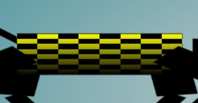
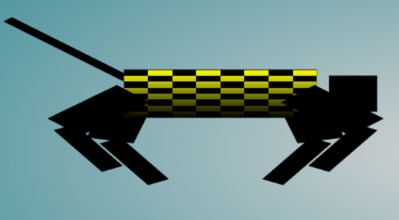
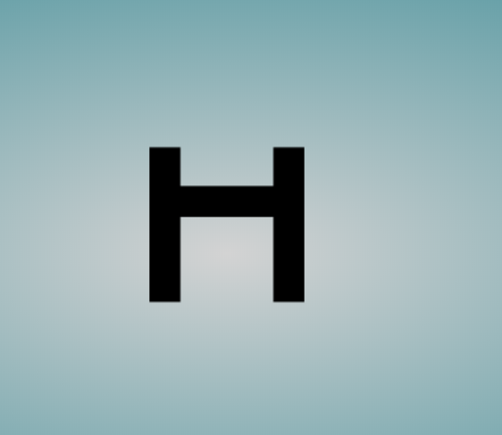
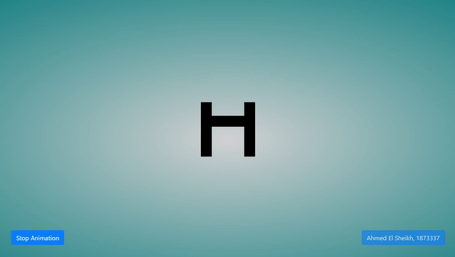

# Interactive Graphics Homework #02

## Hierarchal Model - Brief Introduction

- Basically to build a hierarchical model, it is thought of it as a graph and this graph is connected by nodes, nodes on the same level are known as siblings, nodes on level + 1 are considered as children, nodes on level - 1 are considered as parents.

## Implementation

We have 2 hierarchal models here, one is the horse like structure and the other one is the obstacle

### 1. Horse

#### [I] Horse model

- First of all, we start by building a cube `colorCube()` which function `quad()` will use to build the points array and textures coordinates array.
- I was provided with the functions for the horse blocks and sliders to control the angles as per horse limb.
- I started with removing the sliders as we want the motion to be automated and more dynamic.
- In order to, achieve the required shape we need to have 1 or more rotations as well as a translation for each and every node (horse component/part) in order to do so we add the rotations and translations into a 4x4 homogenous matrix and pass it to the `createNode()` functionality, we set it to render what part we are working on based on an ID assigned earlier, and assign every node to a sibling and a child. Horse basically is made up of 12 nodes tail, head, torso, right and left arms and legs, and legs are made up of upper and lower parts.

#### [II] Horse Texture

- We need to add texture only to the horse's torso, so I added the texture to everything in my canvas using the fragment shader in my `index.html`, and then delete it from the horse nodes - keeping only the torso- how to achieve that?

  - Start by adding texture to our horse, using
    > `var image = createCheckerBoardTexture(); configureTexture(image);`
  - Since our horse is hierarchical model, we can delete texture from one component and its children will inherit the same properties, so in the function responsible for creating the `head()` -which is our parent to all the horse other nodes, I added
    > `gl.deleteTexture(texture);`
  - Linear gradient in texture: as we can see in the below image, the color decreases gradually until it reaches black in the lower part of the torso, how is this done

#### Horse linear gradient

  

#### Horse final shape

  


  ```{JavaScript}
  // checkerboard pattern with linear gradient intensity
  function createCheckerBoardTexture() {
    var image = new Uint8Array(4 * textureSize * textureSize);
    for (var i = 0; i < textureSize; i++) {
        for (var j = 0; j < textureSize; j++) {
            var c = (((i & 0x8) == 0) ^ ((j & 0x8) == 0)) * 255;
            var linear_intensity = 4 * i * textureSize + 4 * j;
            image[4 * i * textureSize + 4 * j] = c * linear_intensity;
            image[4 * i * textureSize + 4 * j + 1] = c * linear_intensity;
            image[4 * i * textureSize + 4 * j + 2] = c * linear_intensity;
            image[4 * i * textureSize + 4 * j + 3] = 255;
        }
    }
    return image;
  }
  ```

#### [III] Horse Animation

- It was required to make the horse jump, so basically jumping we need a starting point to jump and move diagonally from point (x0, y0) to (x1, y1) where we reach the maximum height and start landing to point (x2, y2), given this description jumping can be thought of as forming a triangle. Added to the triangle we need to define the path for the horse.
- So i started with defining

  ```{javascript}
  // Animation responsible angles and their changes
  var current_angle = 0, delta_angle = 1.0, min_angle = -45, max_angle = 60;
  // Defining horse path starting and ending place in x & y
  var torsoX_start = -20.0, torsoX_end = 15, torsoY_start = 0.0, torsoY_end = 5.5;
  ```

- So let us put things together, I added functions responsible for handling the motion of the horse `handle_animation()`

  ```{JavaScript}
  function handle_animation() {
    // Can be controlled by a button
    if (animation_flag) {
        // if horse is not in jumping area
        if (!jump_flag) {
            // walk which is basically incrementing torsoX_start by speed val
            horse_walk();
        }
        // horse is basically moving in traingular form, translating on x-axis
        // increasing in y val to a point, and then decreasing after
        // reaching the peak, restart path when horse finishes it.
        translate_body();
        // make sure jumps from correct pos and speed is
        // sufficient to land after obstacle.
        jump();
    }
  }
  ```

---

### 2. Obstacle

#### [I] Obstacle Model

- In order to, achieve the required shape we need to have 1 or more rotations as well as a translation for each and every node (horse component/part) in order to do so we add the rotations and translations into a 4x4 homogenous matrix and pass it to the `createNode()` functionality, we set it to render what part we are working on based on an ID assigned earlier, and assign every node to a sibling and a child. Horse basically is made up of 3 nodes 2 vertical poles and one horizontal pole.

#### [II] Obstacle Texture

- We need to add texture only to the horse's torso, so I added the texture to everything in my canvas using the fragment shader in my `index.html`, and then delete it from the horse nodes - keeping only the torso-, as well as obstacle nodes, as I mentioned earlier this was achieved using
  > `gl.deleteTexture(texture);`

#### [III] Obstacle Animation

- No animation was required it is a stationary object.

#### Obstacle final shape



---

## Final Overview



---

## References

- My implementation of HW1
- Week 09, Lecture Slides # 6, slides 13 - 18
- Week 12, Lecture Slides # 2, slides 15 - 16, 18
